# 🚰 Parte-Fácil

> Aplicación web interna para la gestión de partes de trabajo, empleados y clientes.

---

  
  
  
  
  

---

## 📋 Descripción

**Parte-Fácil** es una plataforma web para el control y gestión de trabajos, empleados y clientes, con partes de trabajo, asignación de tareas, calendario avanzado y estadísticas.  
La app es responsive y segura, con sistema de roles: **Administrador** y **Trabajador**.

---

## 🚀 Tecnologías usadas

| Tecnología    | Descripción                          |
| ------------- | ------------------------------------ |
| [Flask](https://flask.palletsprojects.com/)         | Framework web ligero en Python |
| [SQLAlchemy](https://www.sqlalchemy.org/)           | ORM para la gestión de base de datos |
| [WTForms](https://wtforms.readthedocs.io/)          | Formularios seguros y validados |
| [Bootstrap 5](https://getbootstrap.com/)            | Framework CSS responsive        |
| [FullCalendar](https://fullcalendar.io/)            | Calendario interactivo JS       |
| [SQLite](https://www.sqlite.org/)                   | Base de datos ligera por defecto |
| [Werkzeug Security](https://werkzeug.palletsprojects.com/) | Hash de contraseñas |
| [Jinja2](https://jinja.palletsprojects.com/)        | Motor de plantillas en Flask    |
| [Pandas](https://pandas.pydata.org/)                  | Procesamiento de datos y exportación a Excel |
| [Openpyxl](https://openpyxl.readthedocs.io/)          | Motor para generar archivos Excel (.xlsx) |
| [xhtml2pdf](https://xhtml2pdf.readthedocs.io/)        | Generador de PDFs a partir de plantillas HTML |

---

## 🏁 Instalación rápida

git clone https://github.com/Tflys/parte-facil.git
cd parte-facil
python -m venv venv
# Windows:
venv\Scripts\activate
# Linux/Mac:
source venv/bin/activate
pip install -r requirements.txt
python app.py
Abre http://127.0.0.1:5000 en tu navegador.

📂 Estructura del proyecto

  
Ver estructura

  <pre>

multiservicios-ortiz/
├── app.py
├── forms.py
├── models.py
├── requirements.txt
├── /instance/
│     └── multiservicios.db
├── /static/
│     ├── css/
│     │     ├── styles.css
│     │     └── ...
│     ├── js/
│     │     ├── scripts.js
│     │     └── ...
│     ├── images/
│     │     ├── favicon.ico
│     │     └── ...
│     └── uploads/
├── /templates/
│     ├── base.html
│     ├── navbar.html
│     ├── footer.html
│     ├── dashboard.html
│     └── ...
└── README.md

  </pre>

🛠️ Funcionalidades principales
🧑‍💼 Gestión de usuarios (administrador y trabajador)

📝 Partes de trabajo: alta, edición, borrado (solo admin)

⏱️ Control de horas trabajadas

📆 Calendario avanzado (FullCalendar) con filtros por cliente y trabajador

📊 Dashboard de estadísticas y KPIs

📤 Exportación de partes de trabajo a PDF y Excel

📂 Gestión avanzada desde panel de administrador: estadísticas, ranking, clientes y estados

🧠 Modo demo activable con datos ficticios (útil para pruebas y presentaciones)

🗂️ Filtros por cliente y trabajador en el calendario (FullCalendar)

📎 Subida de imágenes (foto y firma) con validación segura y control de tipo/tamaño

🔐 Seguridad aplicada
Contraseñas cifradas (hash scrypt/pbkdf2)

CSRF en todos los formularios (Flask-WTF)

Validación y protección de archivos subidos

Límite de tamaño de subida (MAX_CONTENT_LENGTH)

Control estricto de roles y rutas

No debug en producción

📈 Mejoras sugeridas y roadmap
 Límite de intentos de login y bloqueo temporal

 Autenticación 2FA para administradores

 Logs de acceso y cambios

 Exportación a Excel/PDF

 Deploy con HTTPS y dominio propio

📧 Contacto
Desarrollado por [Francisco Alabarce]
Email: franalabarce@gmail.com
Proyecto para Multiservicios Desatascos Ortiz S.L. y TOTAL POOL S.L.

⚖️ Licencia
MIT License

---
## 🛠️ VISTAS

### Vista de login
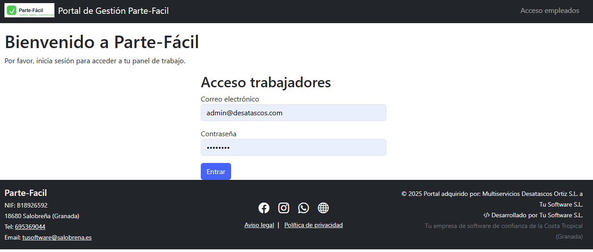
### Vista de partes de trabajo
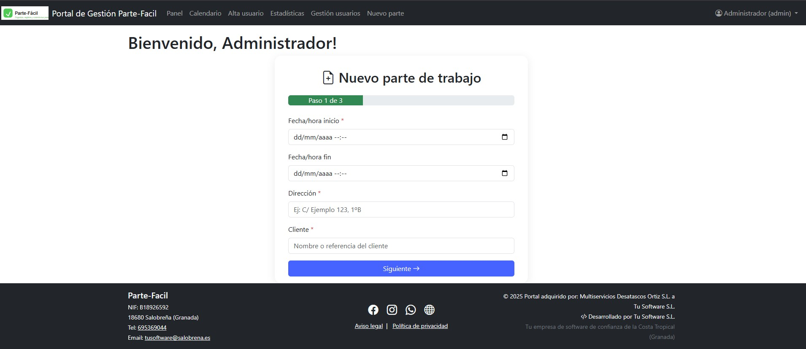
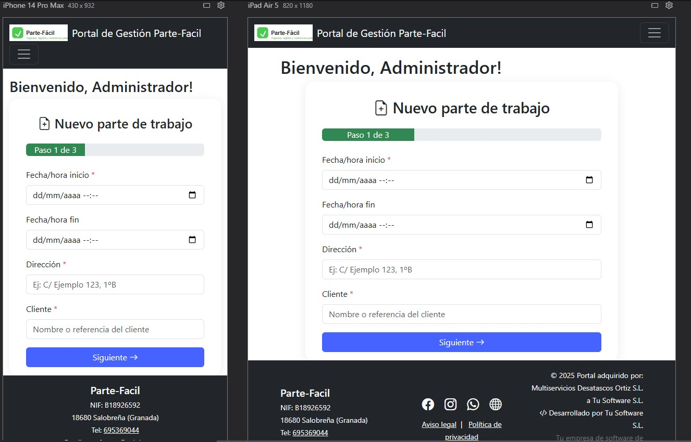
### Vista alta usuario
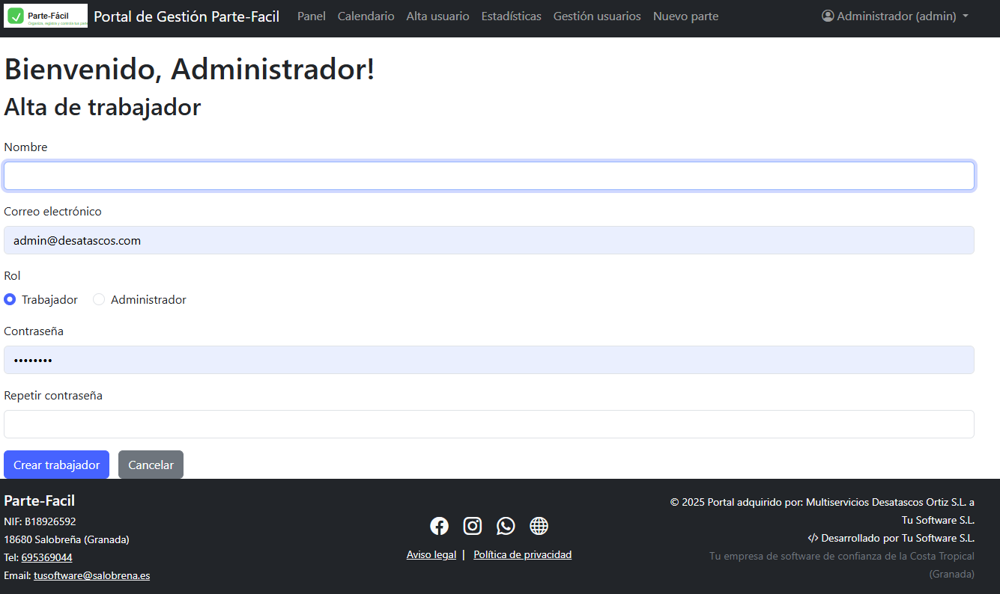
### Vista gestion de usuarios
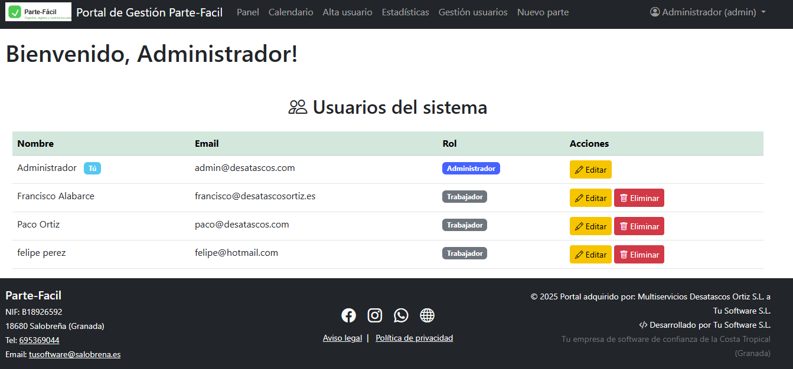
### Vista de panel
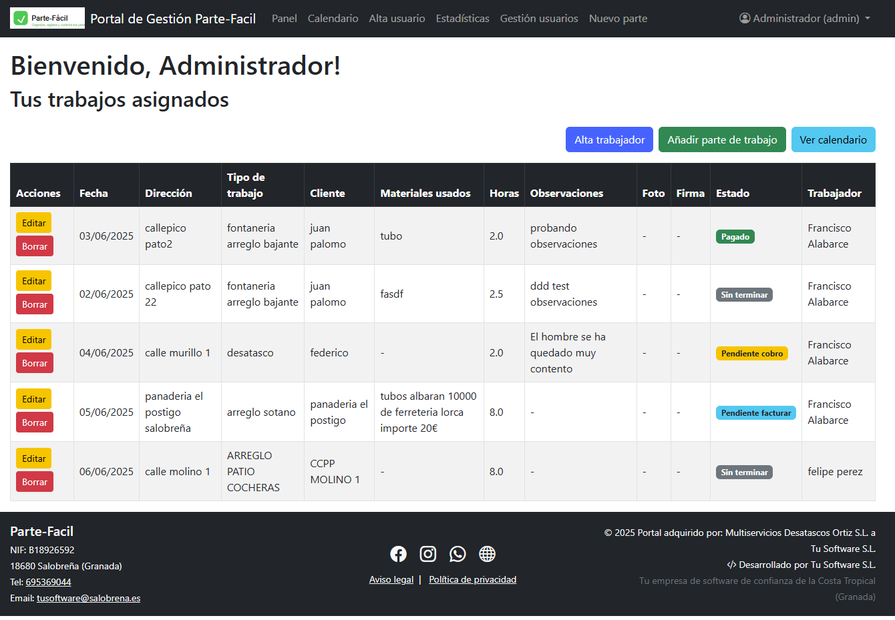
### Vista de calendario
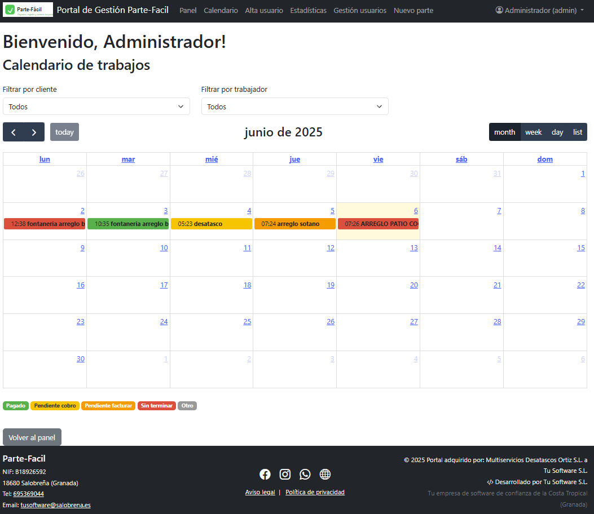
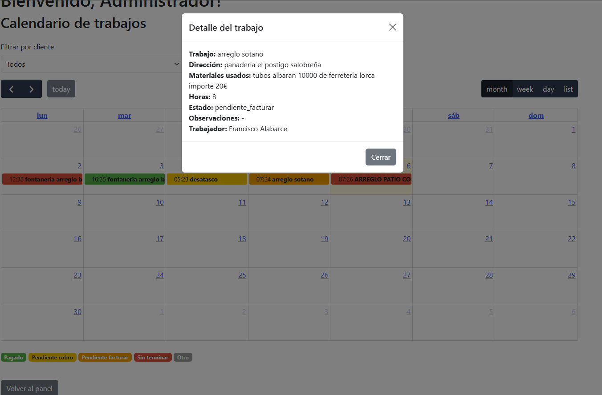
### Vista de estadísticas dashboard
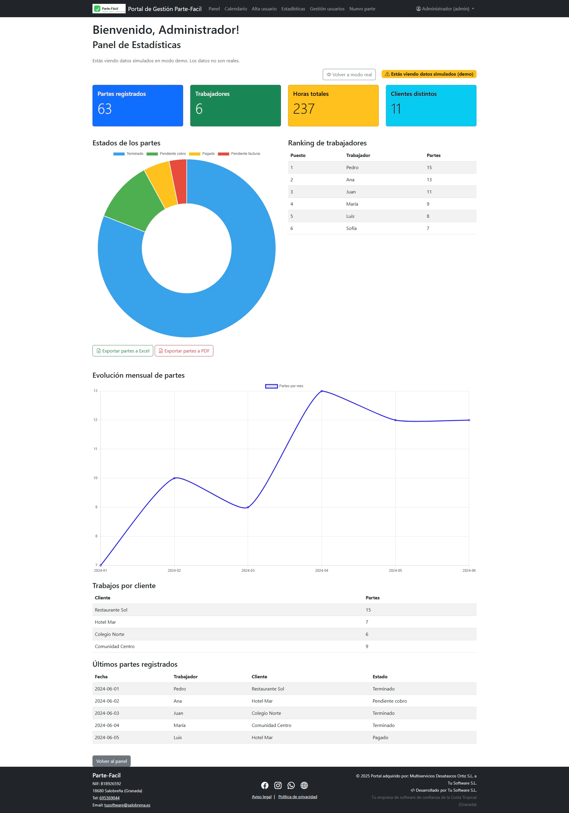
### Vista de gestión de usuarios

---

## 📤 Ejemplo de exportación

Desde el menú de usuario o admin puedes exportar todos tus partes:

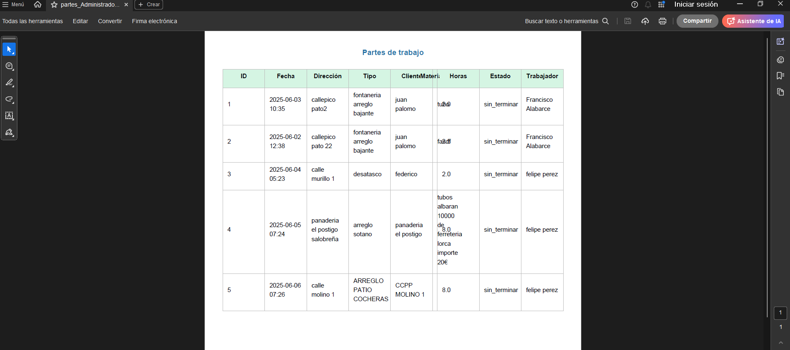
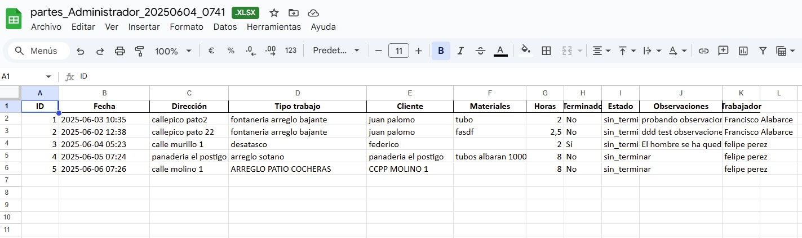
